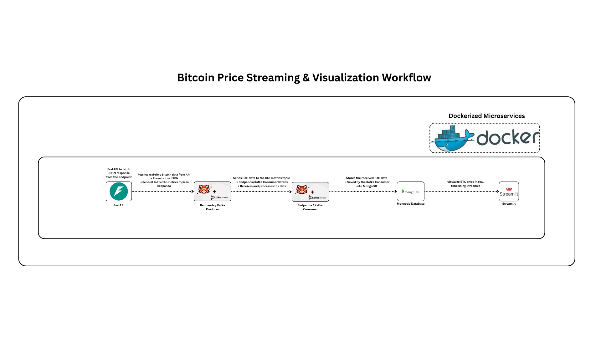

# Real-Time Bitcoin Price Streaming Pipeline

A complete, real-time data streaming pipeline for ingesting, processing, storing, and visualizing live Bitcoin price data. The entire system is built on a dockerized microservices architecture, with each component running in its own container, orchestrated by Docker Compose.

---

## 🏛️ Architecture & Workflow

This diagram illustrates the end-to-end data flow of the microservices pipeline.



The system follows an event-driven pattern where services are decoupled using a message broker (like Kafka or Redpanda). This creates a scalable and resilient data pipeline.

1.  **Producer Service (`/producer` & `/api`):** A Python service (either a standalone script or a FastAPI endpoint) continuously fetches the latest Bitcoin price from an external API. It then publishes this data as a JSON message to a Kafka/Redpanda topic.
2.  **Streaming Platform (Redpanda):** Redpanda, a Kafka-compatible streaming platform, serves as the central message bus. It receives data from the producer and queues it in the `btc-metrics` topic, providing a durable buffer between services.
3.  **Consumer Service (`/consumer`):** A Python script subscribes to the Kafka/Redpanda topic. It listens for new price messages, processes them, and stores them in a MongoDB database for persistence.
4.  **Dashboard Service (`/dashboard`):** A Streamlit application provides the user-facing visualization. It queries the MongoDB database to retrieve data and displays it in a real-time, auto-updating chart.
5.  **Orchestration (`docker-compose.yml`):** The central Docker Compose file defines and connects all the services, their networks, and volumes.

---

## 🛠️ Tech Stack

*   **API / Producer:** [FastAPI](https://fastapi.tiangolo.com/), [Python](https://www.python.org/)
*   **Streaming Platform:** [Redpanda](https://redpanda.com/) (or any Kafka-compatible broker)
*   **Database:** [MongoDB](https://www.mongodb.com/)
*   **Dashboard/Visualization:** [Streamlit](https://streamlit.io/)
*   **Containerization:** [Docker](https://www.docker.com/) & [Docker Compose](https://docs.docker.com/compose/)

---

## 🚀 Getting Started

Follow these instructions to get the entire pipeline up and running on your local machine.

### Prerequisites

*   [**Docker**](https://www.docker.com/get-started) installed and running.
*   [**Docker Compose**](https://docs.docker.com/compose/install/) (usually included with Docker Desktop).
*   [**Git**](https://git-scm.com/) (to clone the repository).

### Installation & Execution

1.  **Clone the Repository**
    ```bash
    git clone https://github.com/your-username/btc-real-time-streaming.git
    cd btc-real-time-streaming
    ```

2.  **Build and Run the Services**
    Use Docker Compose to build the custom images and start all the services.
    ```bash
    docker-compose up --build -d
    ```
    *   `--build`: Forces a rebuild of the images from your `Dockerfile`s.
    *   `-d`: Runs the containers in detached mode (in the background).

3.  **Verify the Services**
    Check the status of all running containers:
    ```bash
    docker-compose ps
    ```
    To view the real-time logs for a specific service (e.g., the consumer), run:
    ```bash
    docker-compose logs -f consumer
    ```

---

## 📁 Project Structure

The repository is organized into directories, with each directory representing a microservice.


## 🖥️ Accessing the Services

*   **Streamlit Dashboard (Visualization):**
    Open your browser and go to: **[http://localhost:8501](http://localhost:8501)**

*   **FastAPI (API Docs):**
    To view the auto-generated API documentation, go to: **[http://localhost:8000/docs](http://localhost:8000/docs)**

---

## 🛑 Stopping the Application

To stop all the services and remove the containers, run the following command in your terminal:
```bash
docker-compose down
